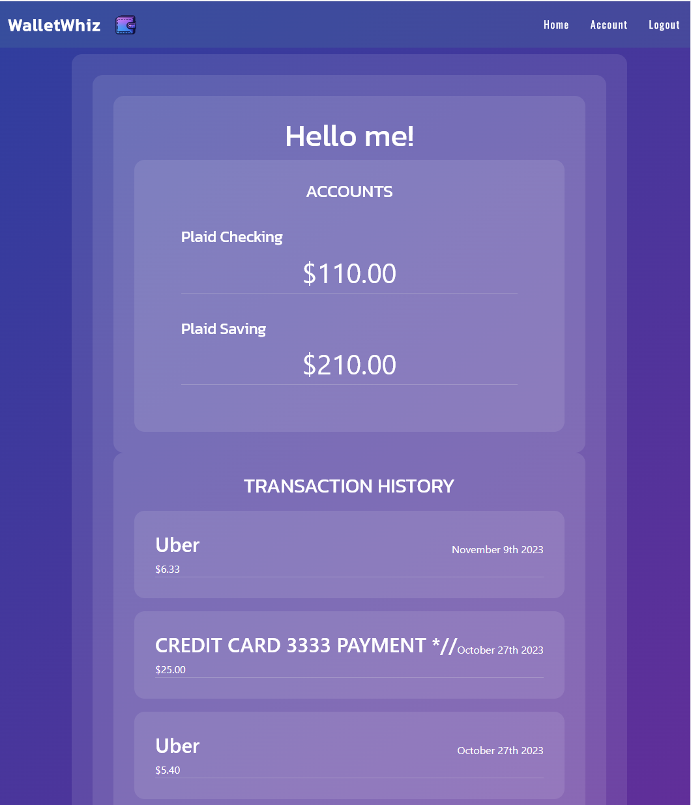

# Project: wallet-wiz-2.0

 

![GitHub]
 <https://github.com/cslunsford/wallet-whiz-2.0>

***

## Technologies

Technologies used:


***

## Table of Contents
- [Description](#description)
- [Requirements](#requierments)
- [Installation](#installation)
- [Instructions](#instructions)
- [Project Usage](#usage)
- [Deployment](#deployment)
- [Contributing](#contributing)
- [Contact Me](#contact)
- [License](#license)

***

## Description

This project is a dynamic full-stack application adhering to the Model-View-Controller (MVC) design pattern, leveraging JavaScript for both its backend and frontend components. It incorporates the Plaid API for seamless financial data integration. The backend is powered by Node.js, ensuring robust server-side functionality, while the front end is developed using JavaScript to create an interactive user experience. Additionally, the application is deployed using React, a popular JavaScript library for building user interfaces and enhancing its responsiveness and interactivity. For database management, it utilizes Mongoose, an object data modeling (ODM) library for MongoDB, along with GraphQL, a query language for APIs. This combination allows for efficient data storage, retrieval, and manipulation, ensuring smooth and scalable database operations. This comprehensive setup provides a versatile financial application with a seamless user interface and efficient data handling.




### Requirements

```
Use Node.js and Express.js to create a RESTful API.

Use react as the templating engine.

Use Mongo Atlas and Mongoose for the database.

Have both GET and POST routes for retrieving and adding new data.

Be deployed using Heroku (with data).

Use at least one new library, package, or technology that we haven’t discussed.

Have a polished UI.

Be responsive.

Be interactive (i.e., accept and respond to user input).

Have a folder structure that meets the MVC paradigm.

Include authentication (express-session and cookies).

Protect API keys and sensitive information with environment variables
```
*** 

## Installation

The installation can be completed by following these instructions:
Clone repository
```
run: npm i
run: npm run develop
```
The main page will open

***Requirments***
All files are in package.json
[Node.js](https://nodejs.org/en/) | [MySQL](https://www.npmjs.com/package/mysql2) | [Mongoose] <https://www.npmjs.com/package/mongoose> | [Express] <https://www.npmjs.com/package/express> | [dotenv] <https://www.npmjs.com/package/dotenv> | [Plaid] <https://www.plaid.com> |
[axios] <https://axios-http.com> | [jquery] <https://jquery.com> | [react] <https://react.com> | [moment] <https://momentjs.com>

### Instructions

1. Clone the GitHub repository to your local computer. Click on the following link.

- Repository link: <https://github.com/cslunsford/wallet-wiz-2.0>

2. Install the following packages:

***Client dependencies***

[apollo/client] | [emotion/react] | [emotion/styled] | [mui/material] [bootstrap] | [chart.js] | [graphql] | [OAuth] | [JWT] | [react-bootstrap] |[react-chartjs-2] | [react-currency-format] | [react-dom] | [react-plaid-link] | [react-router-dom]

***Server dependencies***

[apollo/server] | [bcrypt] | [body-parser] | [cors] | [jsonwebtoken] | [mongoose] | [plaid]

***Dev Dependencies***

[nodemon](https://nodemon.io/)

    --<--input the terminal commands for running the app-->

    The application will then begin to run locally.

***

## Usage  

To execute the script, open a Git terminal on the main project folder (cloned folder) Run the following command: 
```
npm run develop
```

### Deployment

Link to Heroku
[Click] (https://frozen-brushlands-26062-9afa804fc3f2.herokuapp.com/)
***

## Contributing

<br>
Chaz Coats            Github: ChazCoats98
</br><br>
Christopher Lunsford  Github: Cslunsford
</br><br>
Danik Therrien        Github: DrDanik88
</br><br>
Ronald Curcurato      Github: Rcurcurato
</br><br>
Jason Obeng Dappah    Github: JObengDappah
</br>

## Contact

For additional questions, Github page:(<https://github.com/cslunsford/wallet-whiz-2.0>)

***

## License

This application is covered under the MIT License.

Copyright (c) November 2023  

    This software/code is licensed under the MIT License; 
    to use this software/code you must agree to follow and comply with the License.
    A copy of the License can be found at: https://www.gnu.org/licenses/gpl-3.0.md 
